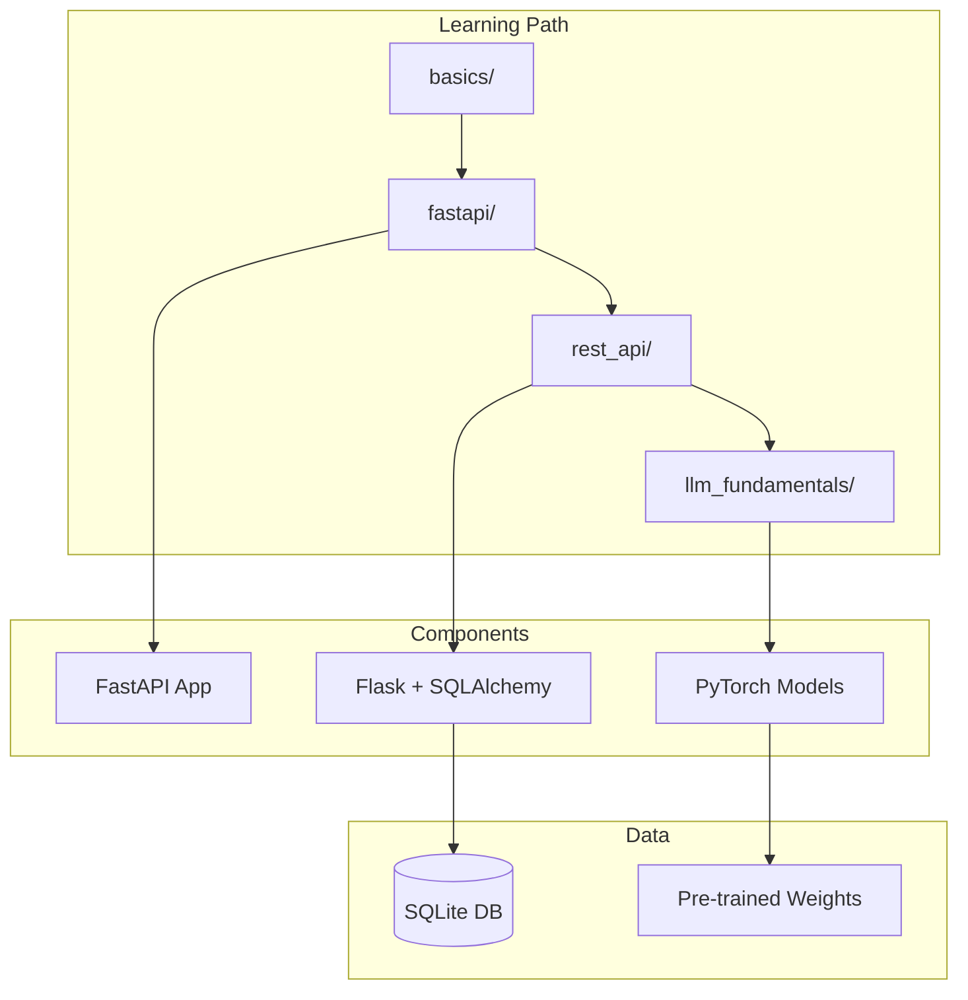

# 📚 DOCUMENTATION GAPS - Priority: MEDIUM

---

## Issue #32: SECURITY.md is Placeholder Text

### Title
[DOCUMENTATION]: Replace SECURITY.md placeholder with actual security policy

### Description

**What:** The SECURITY.md file contains generic GitHub template text, not actual security information for this project.

**Why it matters:** 
- Users don't know how to report vulnerabilities
- No supported versions listed
- Unprofessional appearance

**Where:** `SECURITY.md`

**Current content:**
```markdown
# Security Policy

## Supported Versions
| Version | Supported |
| ------- | --------- |
| 5.1.x   | ✅        |
| 5.0.x   | ❌        |
...
```

**Expected content:**
- How to report security issues
- Response time expectations
- Supported Python versions
- Security best practices for users

**Suggested approach:**
```markdown
# Security Policy

## Reporting a Vulnerability

We take security seriously. If you discover a vulnerability, please report it by:

1. **DO NOT** create a public GitHub issue
2. Email: security@example.com (or open a private vulnerability report)
3. Include:
   - Description of the vulnerability
   - Steps to reproduce
   - Potential impact
   - Suggested fix (if any)

## Response Timeline

- Initial response: Within 48 hours
- Status update: Within 5 business days
- Resolution target: Within 30 days

## Supported Versions

| Python Version | Supported |
| -------------- | --------- |
| 3.12           | ✅        |
| 3.11           | ✅        |
| 3.10           | ✅        |
| < 3.10         | ❌        |

## Security Best Practices

- Never run with debug=True in production
- Use environment variables for secrets
- Keep dependencies updated
- Enable rate limiting
```

**Acceptance criteria:**
- [ ] Remove all placeholder text
- [ ] Add vulnerability reporting process
- [ ] List supported Python versions
- [ ] Add response time expectations
- [ ] Include security best practices

**Labels:** `documentation`, `security`, `good first issue`, `priority: high`

---

## Issue #33: Missing API Documentation

### Title
[DOCUMENTATION]: Add comprehensive API documentation

### Description

**What:** APIs have no standalone documentation beyond inline docstrings.

**Why it matters:** 
- Users don't know how to use APIs
- Increases support burden
- Unprofessional

**Where:** `fastapi/`, `rest_api/`

**Suggested approach:**

Create API.md:
```markdown
# API Documentation

## FastAPI Campaign Management

### Base URL
```
http://localhost:8000
```

### Authentication
Currently no authentication required.

## Endpoints

### GET /campaigns
List all campaigns.

**Response:**
```json
[
  {
    "campaign_id": 1,
    "name": "Summer Launch",
    "due_date": "2026-06-15T00:00:00",
    "created_at": "2026-02-19T12:00:00"
  }
]
```

### POST /campaigns
Create a new campaign.

**Request:**
```json
{
  "name": "New Campaign",
  "due_date": "2026-12-31T00:00:00"
}
```

**Response:** 201 Created
```json
{
  "campaign_id": 3,
  "name": "New Campaign",
  ...
}
```

### Error Codes
| Code | Meaning |
|------|---------|
| 400  | Bad Request - Invalid input |
| 404  | Not Found |
| 429  | Too Many Requests |
| 500  | Server Error |
```

**Acceptance criteria:**
- [ ] Create API.md with all endpoints
- [ ] Include request/response examples
- [ ] Document all error codes
- [ ] Add authentication section
- [ ] Include rate limiting info
- [ ] Add OpenAPI/Swagger link

**Labels:** `documentation`, `enhancement`, `priority: medium`

---

## Issue #34: No Inline Comments for Complex Logic

### Title
[DOCUMENTATION]: Add inline comments for complex algorithms

### Description

**What:** Complex algorithms lack explanatory comments.

**Why it matters:** 
- Hard for beginners to understand
- Increases learning curve
- Knowledge not captured

**Where:** Multiple files

**Examples needing comments:**
```python
# llm_fundamentals/architecture/01_transformer_architecture.py
def generate_text_simple(model, idx, max_new_tokens, context_size):
    # No explanation of what this does or how
    for _ in range(max_new_tokens):
        idx_cond = idx[:, -context_size:]
        ...

# basics/03_control_flow/02_check_prime.py
for i in range(2, int(num * 0.5) + 1):
    # Why 0.5? Why not num // 2 or sqrt(num)?
    if((num % i) == 0):
        ...
```

**Suggested approach:**
```python
def generate_text_simple(model, idx, max_new_tokens, context_size):
    """
    Generate text token by token.
    
    Args:
        model: The language model
        idx: Input tokens (batch, seq_len)
        max_new_tokens: Maximum tokens to generate
        context_size: Model's maximum context length
    
    Process:
        1. Crop context if it exceeds model's limit
        2. Get model predictions for next token
        3. Sample from probability distribution
        4. Append to sequence
    """
    for _ in range(max_new_tokens):
        # Crop context to fit model's maximum
        # Only use the last `context_size` tokens
        idx_cond = idx[:, -context_size:]
        ...
```

**Acceptance criteria:**
- [ ] Add docstrings to all functions > 10 lines
- [ ] Add inline comments for non-obvious logic
- [ ] Explain algorithm choices
- [ ] Add complexity notes where relevant
- [ ] Include examples in docstrings

**Labels:** `documentation`, `code quality`, `priority: medium`

---

## Issue #35: Missing Architecture Diagram

### Title
[DOCUMENTATION]: Add system architecture diagram

### Description

**What:** No visual representation of system architecture.

**Why it matters:** 
- Hard to understand component relationships
- Onboarding takes longer
- Design decisions not documented

**Where:** Root README or separate ARCHITECTURE.md

**Suggested approach:**
Create ARCHITECTURE.md with Mermaid diagram:

```markdown
# System Architecture

## Overview



## Component Details

### basics/
Pure Python learning modules - no external dependencies.

### fastapi/
Modern REST API with in-memory storage.

### rest_api/
Flask-based API with SQLAlchemy ORM.

### llm_fundamentals/
PyTorch-based transformer implementation.
```

**Acceptance criteria:**
- [ ] Create ARCHITECTURE.md
- [ ] Add Mermaid diagram
- [ ] Document each major component
- [ ] Show data flow
- [ ] List external dependencies
- [ ] Link to detailed docs

**Labels:** `documentation`, `enhancement`, `priority: low`

---

## Issue #36: No Code of Conduct

### Title
[DOCUMENTATION]: Add Code of Conduct

### Description

**What:** Project has no Code of Conduct.

**Why it matters:** 
- Sets community expectations
- Provides enforcement guidelines
- Required for many open source programs
- Makes project more inclusive

**Where:** CODE_OF_CONDUCT.md (new file)

**Suggested approach:**
Use Contributor Covenant (industry standard):

```markdown
# Contributor Covenant Code of Conduct

## Our Pledge

We as members, contributors, and leaders pledge to make participation 
in our community a harassment-free experience for everyone...

## Our Standards

Examples of behavior that contributes to a positive environment:
- Demonstrating empathy and kindness
- Respecting differing opinions
- Giving and accepting constructive feedback
- Taking responsibility for mistakes

Examples of unacceptable behavior:
- Trolling, insulting comments
- Public or private harassment
- Publishing others' private information
- Other conduct inappropriate in professional setting

## Enforcement Responsibilities

Community leaders are responsible for clarifying and enforcing standards...

## Scope

This Code of Conduct applies within all community spaces...

## Enforcement

Instances of abuse may be reported to: conduct@example.com

## Attribution

This Code of Conduct is adapted from the Contributor Covenant...
```

**Acceptance criteria:**
- [ ] Create CODE_OF_CONDUCT.md
- [ ] Use Contributor Covenant 2.1
- [ ] Add enforcement contact
- [ ] Link from README
- [ ] Link from CONTRIBUTING.md

**Labels:** `documentation`, `community`, `priority: medium`

---

## Issue #37: No Quick Start Examples

### Title
[DOCUMENTATION]: Add quick start guide with copy-paste examples

### Description

**What:** No single document with copy-paste examples to get started quickly.

**Why it matters:** 
- Beginners overwhelmed by choices
- Time to first success too long
- Users may give up

**Where:** QUICKSTART.md (new file) or enhanced README section

**Suggested approach:**
```markdown
# Quick Start Guide

## 5 Minutes to Your First Program

### Step 1: Run Hello World
```bash
cd basics/01_introduction
python3 01_hello_world.py
```

Expected output:
```
ram
Hello World
```

### Step 2: Try Interactive Program
```bash
python3 02_user_input_addition.py
# Enter: 5
# Enter: 3
# Output: 8
```

### Step 3: Play a Game
```bash
cd ../11_projects
python3 01_guess_number.py
```

## Next Steps

1. Complete all `basics/` modules (2-4 hours)
2. Build your first API with `fastapi/` (1 hour)
3. Explore AI with `llm_fundamentals/` (4+ hours)

## Common Issues

**"python3: command not found"**
- Install Python from python.org

**"ModuleNotFoundError"**
- Run: `pip install -r requirements.txt`

**"Permission denied"**
- Run: `chmod +x *.py`
```

**Acceptance criteria:**
- [ ] Create QUICKSTART.md
- [ ] Include copy-paste commands
- [ ] Show expected output
- [ ] Add troubleshooting section
- [ ] Link from README
- [ ] Test all examples

**Labels:** `documentation`, `beginner-friendly`, `priority: high`

---

## Issue #38: Missing Troubleshooting Guide

### Title
[DOCUMENTATION]: Add comprehensive troubleshooting guide

### Description

**What:** No centralized troubleshooting guide for common issues.

**Why it matters:** 
- Same questions asked repeatedly
- Users get stuck easily
- Support burden increases

**Where:** TROUBLESHOOTING.md (new file)

**Suggested approach:**
```markdown
# Troubleshooting Guide

## Installation Issues

### Python not found
**Problem:** `python3: command not found`
**Solution:** Install Python 3.10+ from python.org

### pip not found
**Problem:** `pip: command not found`
**Solution:** 
```bash
python3 -m ensurepip --upgrade
```

## Dependency Issues

### ModuleNotFoundError
**Problem:** `No module named 'fastapi'`
**Solution:**
```bash
pip install -r requirements.txt
```

### Version conflicts
**Problem:** Conflicting package versions
**Solution:**
```bash
python3 -m venv .venv
source .venv/bin/activate
pip install -r requirements.txt
```

## API Issues

### Port already in use
**Problem:** `Address already in use`
**Solution:**
```bash
# Find and kill process
lsof -i :8000
kill -9 <PID>
```

### Database locked
**Problem:** `database is locked`
**Solution:**
```bash
rm rest_api/travel.db
python3 rest_api/main.py
```

## LLM Issues

### CUDA out of memory
**Problem:** GPU runs out of memory
**Solution:**
- Use smaller model
- Reduce batch size
- Use CPU: `export CUDA_VISIBLE_DEVICES=""`

### Model download fails
**Problem:** Timeout downloading weights
**Solution:**
- Check internet connection
- Use mirror: [link]
- Download manually
```

**Acceptance criteria:**
- [ ] Create TROUBLESHOOTING.md
- [ ] Include installation issues
- [ ] Include dependency issues
- [ ] Include API issues
- [ ] Include LLM-specific issues
- [ ] Add "still stuck?" section

**Labels:** `documentation`, `beginner-friendly`, `priority: medium`

---
